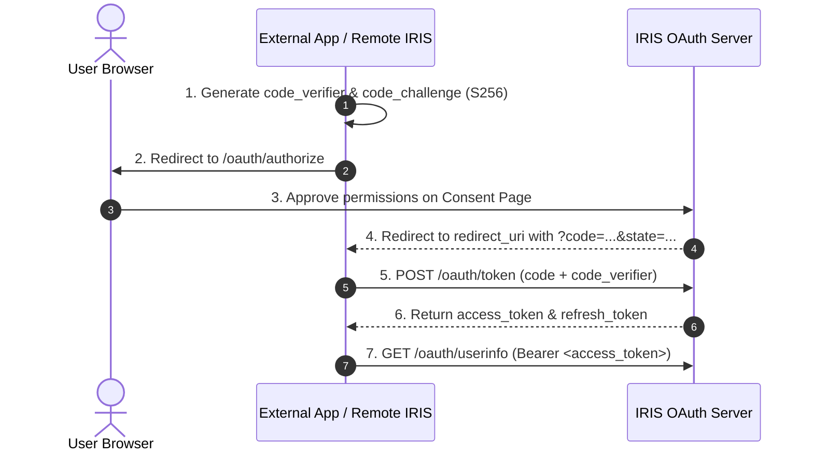

# IRIS OAuth 2.0 & OpenID Connect (OIDC) Architecture Guide

IRIS features a full-fledged, RFC-compliant **OAuth 2.0** and **OpenID Connect (OIDC)** authorization server and identity provider. This system enables external applications (web apps, SPAs, mobile apps, desktop clients, CLI tools, bots) to authenticate against IRIS and allows independent IRIS instances to federate accounts and synchronize media libraries.

---

## 1. RFC Standards & Endpoints

| Protocol Standard | Endpoint / Resource | Description |
| :--- | :--- | :--- |
| **RFC 8414 / OIDC Discovery** | `GET /.well-known/openid-configuration`<br>`GET /.well-known/oauth-authorization-server` | Machine-readable endpoint and capability discovery. |
| **RFC 6749 & RFC 7636 (PKCE)** | `GET /oauth/authorize`<br>`POST /oauth/authorize` | Authorization consent screen, parameters validation, and authorization code issuance. |
| **RFC 6749 Token Endpoint** | `POST /oauth/token` | Exchange authorization code with PKCE verifier, refresh token, or client credentials. |
| **OIDC Core 1.0 UserInfo** | `GET /oauth/userinfo` | Identity claims (`sub`, `username`, `name`, `email`, `avatarUrl`, `profileUrl`). |
| **RFC 7009 Token Revocation** | `POST /oauth/revoke` | Revoke active access or refresh tokens. |
| **RFC 7662 Token Introspection**| `POST /oauth/introspect` | Inspect token validity, granted scopes, and subject identity. |
| **RFC 7591 Dynamic Registration**| `POST /oauth/register` | Automated client application registration. |
| **Developer Apps Management** | `GET, POST /oauth/apps`<br>`GET, PATCH, DELETE /oauth/apps/:id`<br>`POST /oauth/apps/:id/regenerate-secret` | Developer application lifecycle and credential management. |
| **User Grants Management** | `GET /oauth/authorizations`<br>`DELETE /oauth/authorizations/:id` | Inspection and revocation of user-authorized third-party applications. |

---

## 2. Database Models (`@IRIS/database`)

Located in [`packages/database/schema/oauth.prisma`](file:///c:/Users/yki/Documents/GitHub/IRIS/packages/database/schema/oauth.prisma):

- **`OAuthClient`**: Registered OAuth client application (`clientId`, `clientSecret` [Argon2 hashed], `redirectUris`, `allowedScopes`, `isPublic`, `isTrusted`).
- **`OAuthAuthorizationCode`**: Ephemeral single-use authorization codes (`code` [SHA-256 hashed], `codeChallenge`, `codeChallengeMethod`, `expiresAt` [10 min lifespan]).
- **`OAuthAccessToken`**: Cryptographically secure Bearer tokens (`token` [SHA-256 hashed], `scopes`, `expiresAt` [30 days default]).
- **`OAuthRefreshToken`**: Long-lived refresh tokens (`token` [SHA-256 hashed], `expiresAt` [90 days default]).
- **`OAuthConsent`**: User-approved scope records per client application.

> **Security Rule: Replay Detection**: Per RFC 6749 §4.1.2, if an authorization code is presented more than once (`usedAt !== null`), the server treats this as a replay attack and immediately revokes all previously issued tokens for that client and authorization session.

---

## 3. Scopes & Elysia Route Protection

### Supported Scopes
All scopes are defined in [`apps/elysia/src/modules/IRIS-account/oauth/helpers/oauth-utils.ts`](file:///c:/Users/yki/Documents/GitHub/IRIS/apps/elysia/src/modules/IRIS-account/oauth/helpers/oauth-utils.ts):

- `identify`: Basic username, user ID, and avatar.
- `profile`: Extended profile bio, banner, and preferences.
- `email`: Primary email address.
- `lists:read`: Read-only access to user media lists (anime, manga, movies, TV, games, books, music).
- `lists:write`: Write access to add, update progress, or delete list items.
- `activity:read`: Read recent activities and scrobbles.
- `activity:write`: Publish activity updates and scrobble media.
- `offline_access`: Issues a `refresh_token` for persistent offline background access.

### Protecting Elysia Routes with `requireScopes`
Elysia routes define required OAuth scopes in their route options:

```typescript
import { defineRoute, t } from "../../../../router"

export default defineRoute({
  GET: {
    authGuard: {
      requireAuth: true,
      requireScopes: ["lists:read"], // Checked if session.method === "oauth"
    },
    async handler({ session, prisma }) {
      // session.user is authenticated
      // session.hasScope("lists:read") is true
      return { success: true }
    }
  }
})
```

### Elysia Session Integration (`session.ts`)
When an incoming request carries `Authorization: Bearer iris_at_...`:
- The session plugin queries `prisma.oAuthAccessToken` via SHA-256 hash.
- Sets `session.method = "oauth"`.
- Populates `session.oauthScopes = accessToken.scopes`.
- Populates `session.oauthClientId = accessToken.clientId`.
- Provides `session.hasScope(scope: string): boolean`.

---

## 4. Authorization Code Flow with PKCE

All clients should use **PKCE (S256)**:



### 1. Build Authorization URL
```
https://<iris-host>/oauth/authorize?
  response_type=code&
  client_id=<CLIENT_ID>&
  redirect_uri=<REDIRECT_URI>&
  scope=identify%20profile%20lists:read%20offline_access&
  state=<RANDOM_STATE>&
  code_challenge=<BASE64URL_SHA256_HASH>&
  code_challenge_method=S256
```

### 2. Exchange Code at `/oauth/token`
```http
POST https://<iris-host>/oauth/token
Content-Type: application/json

{
  "grant_type": "authorization_code",
  "client_id": "<CLIENT_ID>",
  "client_secret": "<CLIENT_SECRET>", // Omit for public clients (SPAs/mobile)
  "code": "<AUTH_CODE>",
  "redirect_uri": "<REDIRECT_URI>",
  "code_verifier": "<UNHASHED_PKCE_VERIFIER>"
}
```

### 3. Fetch User Profile at `/oauth/userinfo`
```http
GET https://<iris-host>/oauth/userinfo
Authorization: Bearer iris_at_...
```

---

## 5. Client Integration Patterns

### NextAuth.js / Auth.js (Next.js)
```typescript
import NextAuth from "next-auth"

export const authOptions = {
  providers: [
    {
      id: "iris",
      name: "IRIS",
      type: "oauth",
      wellKnown: `${process.env.IRIS_URL}/.well-known/openid-configuration`,
      authorization: { params: { scope: "identify profile email lists:read offline_access" } },
      clientId: process.env.IRIS_CLIENT_ID!,
      clientSecret: process.env.IRIS_CLIENT_SECRET!,
      checks: ["pkce", "state"],
      profile(profile: any) {
        return {
          id: profile.sub || profile.id,
          name: profile.name || profile.username,
          email: profile.email,
          image: profile.avatarUrl,
        }
      },
    },
  ],
}
```

### Vanilla TypeScript (Node / Web)
```typescript
import { createHash, randomBytes } from "node:crypto"

export function generatePkce() {
  const codeVerifier = randomBytes(32).toString("base64url")
  const codeChallenge = createHash("sha256").update(codeVerifier).digest("base64url")
  return { codeVerifier, codeChallenge }
}
```

---

## 6. Cross-Instance Federation (`@IRIS/connections`)

Independent IRIS servers federate through [`IrisAdapter`](file:///c:/Users/yki/Documents/GitHub/IRIS/packages/connections/src/providers/iris/iris.adapter.ts):

1. User opens **Settings** > **Connections** > **Connect IRIS**.
2. User provides the remote IRIS instance URL (`https://remote-iris.example.com`).
3. Local instance calls `adapter.getAuthUrl({ hostUrl, redirectUri, state })`.
4. Remote server prompts user to authorize federated sync.
5. Callback exchanges code with remote server via `adapter.exchangeAuthCode(...)`.
6. Tokens are stored encrypted at rest via envelope encryption (`encryptConnectionData`).
7. `adapter.fetchUserLibrary` and `adapter.scrobbleMedia` keep lists synchronized.

---

## 7. Web UI Components (`apps/web`)

Adhere strictly to [`design.md`](file:///c:/Users/yki/Documents/GitHub/IRIS/design.md) (Mauve neutral base, Rose theme accent, `@tabler/icons-react`):

- **Consent Screen**: [`apps/web/app/oauth/authorize/page.tsx`](file:///c:/Users/yki/Documents/GitHub/IRIS/apps/web/app/oauth/authorize/page.tsx)
- **Developer Apps Management**: [`apps/web/components/navigation/settings-tabs/account/oauth-apps-tab.tsx`](file:///c:/Users/yki/Documents/GitHub/IRIS/apps/web/components/navigation/settings-tabs/account/oauth-apps-tab.tsx)
- **User Authorized Apps**: [`apps/web/components/navigation/settings-tabs/account/authorized-apps-tab.tsx`](file:///c:/Users/yki/Documents/GitHub/IRIS/apps/web/components/navigation/settings-tabs/account/authorized-apps-tab.tsx)
- **Connections Connect Modal**: [`apps/web/components/navigation/settings-tabs/account/connections/connect-dialog.tsx`](file:///c:/Users/yki/Documents/GitHub/IRIS/apps/web/components/navigation/settings-tabs/account/connections/connect-dialog.tsx)
- **Comprehensive Developer Guide**: [`guides/oauth-implementation.md`](file:///c:/Users/yki/Documents/GitHub/IRIS/guides/oauth-implementation.md)
