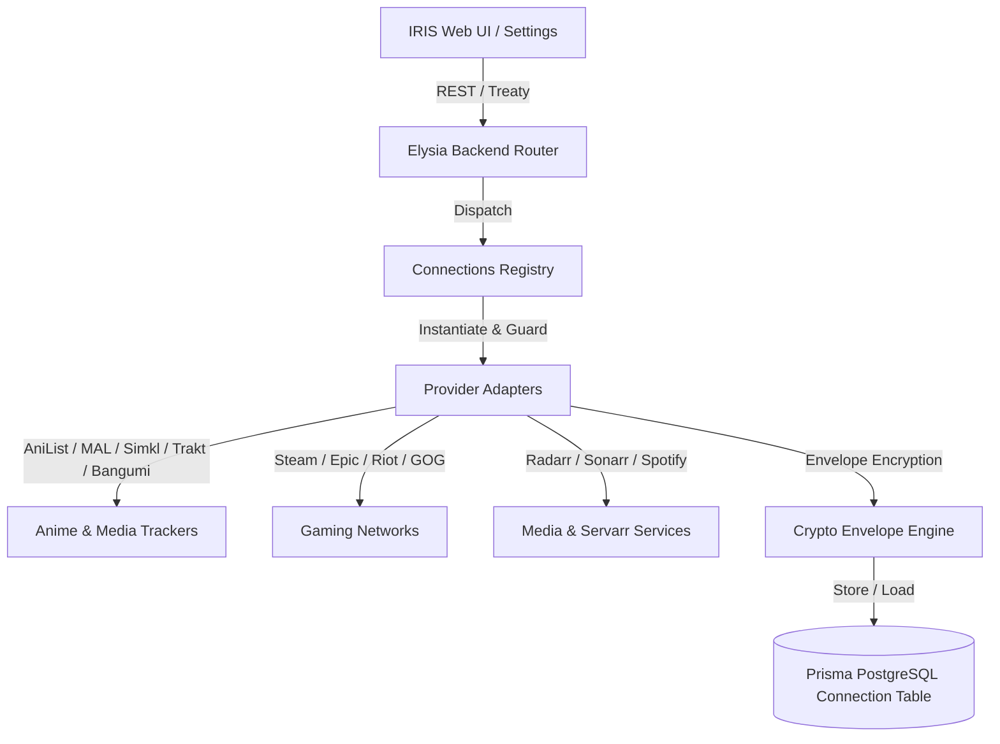

# IRIS Connections Specification (`@IRIS/connections`)

## 1. Executive Summary

`@IRIS/connections` is the unified third-party connection and integration layer for IRIS. It provides secure authentication, encrypted credential storage, automated scrobbling, watchlist synchronization, gaming activity integration, and search quota offloading across tracking services, media servers, and gaming platforms.

---

## 2. Architecture & Design Principles



### Key Pillars:
1. **Isolated & Extensible Provider Adapters**: Every integration implements a standard `ConnectionProviderAdapter` interface with typed capabilities, normalized metadata, and uniform error semantics.
2. **Hybrid User Envelope Encryption**: Credentials and OAuth refresh tokens are encrypted at rest using per-user AES-256-GCM encryption keys derived via HKDF-SHA256 from the user's master salt. No plaintext credentials exist in the database.
3. **Smart Search Quota Offloading**: Searches for media items prioritize active user tokens to prevent hitting global application API rate limits and quotas.
4. **Environment Guardrails & Auto-Disabling**: Providers with missing required server environment variables are automatically marked as disabled, log descriptive startup warnings, and gracefully notify the frontend without crashing the application.
5. **Self-Healing Token Lifecycle**: Access tokens are verified before every API request, automatically refreshed using encrypted refresh tokens when expired, and re-encrypted and persisted without user intervention.

---

## 3. Supported Providers & Authentication Types

| Provider | Category | Auth Method | Capabilities | Required Server Env Vars | Optional Env Vars |
| :--- | :--- | :--- | :--- | :--- | :--- |
| **AniList** | Tracking | OAuth2 (Authorization Code) | Search, Watchlist Sync, Scrobble | `ANILIST_CLIENT_ID`, `ANILIST_CLIENT_SECRET` | - |
| **MyAnimeList** | Tracking | OAuth2 + PKCE (S256) | Search, Watchlist Sync, Scrobble | `MAL_CLIENT_ID` | `MAL_CLIENT_SECRET` |
| **Simkl** | Tracking | OAuth2 (Authorization Code) | Search, Watchlist Sync, Scrobble | `SIMKL_CLIENT_ID`, `SIMKL_CLIENT_SECRET` | - |
| **Trakt.tv** | Tracking | OAuth2 (Authorization Code) | Search, Watchlist Sync, Scrobble | `TRAKT_CLIENT_ID`, `TRAKT_CLIENT_SECRET` | - |
| **Bangumi** | Tracking | OAuth2 / Personal Token | Search, Subject Sync, Scrobble | `BANGUMI_CLIENT_ID`, `BANGUMI_CLIENT_SECRET` | - |
| **Steam** | Gaming | OpenID 2.0 / Web API | Profile, Game Library, Recent Activity | `STEAM_API_KEY` | - |
| **Epic Games** | Gaming | OAuth2 (EOS) / Exchange Code | Profile, Owned Entitlements | `EPIC_CLIENT_ID`, `EPIC_CLIENT_SECRET` | - |
| **Riot Games** | Gaming | Riot Sign-On / Riot API Key | Riot ID, Summoner Profile, Rank | `RIOT_CLIENT_ID`, `RIOT_CLIENT_SECRET` | `RIOT_API_KEY` |
| **GOG.com** | Gaming | OAuth2 (GOG Galaxy) | Profile, Game Library, Hours | `GOG_CLIENT_ID`, `GOG_CLIENT_SECRET` | - |
| **Spotify** | Music | OAuth2 + PKCE | Listening Status, Top Tracks | `SPOTIFY_CLIENT_ID`, `SPOTIFY_CLIENT_SECRET` | - |
| **Radarr** | Servarr | API Key + Host URL | Movie Search, Grab, Monitoring | - | - |
| **Sonarr** | Servarr | API Key + Host URL | Series Search, Grab, Monitoring | - | - |

---

## 4. Cryptographic Security & Envelope Model

All connection tokens and credentials are encrypted using an envelope encryption schema:

```
+-----------------------------------------------------------------------------------+
| Ciphertext Format:  <12-byte IV Hex> : <16-byte AuthTag Hex> : <Ciphertext Hex>   |
+-----------------------------------------------------------------------------------+
```

### Key Derivation Pipeline:
- **Master Secret**: `process.env.CONNECTIONS_SECRET || process.env.NEXTAUTH_SECRET`
- **HKDF Algorithm**: HMAC-SHA256
- **Salt**: `iris-user-conn-salt:${userId}`
- **Info**: `iris:connection-envelope:${userId}`
- **Output Key**: 256 bits (32 bytes)
- **Encryption Algorithm**: AES-256-GCM (Authenticated Encryption with Associated Data)

### Security Benefits:
- **Per-User Key Isolation**: User A cannot decrypt User B's tokens even with direct database read access.
- **Tamper Resistance**: Any alteration of ciphertext, IV, or auth tag immediately triggers an authentication tag mismatch error, preventing forged payload injection.

---

## 5. Required Environment Variables Reference

Add the following environment variables to your `.env` or deployment configuration:

### Core Encryption
```bash
# Master secret used for deriving user envelope encryption keys (falls back to NEXTAUTH_SECRET if not set)
CONNECTIONS_SECRET="your-super-secret-random-32-byte-hex-string"
```

### Tracking Integrations (OAuth2)
```bash
# AniList API (https://anilist.co/settings/developer)
ANILIST_CLIENT_ID="your_anilist_client_id"
ANILIST_CLIENT_SECRET="your_anilist_client_secret"

# MyAnimeList API (https://myanimelist.net/apiconfig)
MAL_CLIENT_ID="your_mal_client_id"
MAL_CLIENT_SECRET="your_mal_client_secret" # (Optional when using PKCE)

# Simkl API (https://simkl.com/settings/developer/)
SIMKL_CLIENT_ID="your_simkl_client_id"
SIMKL_CLIENT_SECRET="your_simkl_client_secret"

# Trakt.tv API (https://trakt.tv/oauth/applications)
TRAKT_CLIENT_ID="your_trakt_client_id"
TRAKT_CLIENT_SECRET="your_trakt_client_secret"

# Bangumi (https://bgm.tv/dev/app) - Optional: Users can also input Personal Access Tokens
BANGUMI_CLIENT_ID="your_bangumi_client_id"
BANGUMI_CLIENT_SECRET="your_bangumi_client_secret"
```

### Gaming Integrations
```bash
# Steam Web API (https://steamcommunity.com/dev/apikey)
STEAM_API_KEY="your_steam_web_api_key"

# Epic Games / EOS (https://dev.epicgames.com/portal)
EPIC_CLIENT_ID="your_epic_client_id"
EPIC_CLIENT_SECRET="your_epic_client_secret"

# Riot Games Developer Portal (https://developer.riotgames.com)
RIOT_CLIENT_ID="your_riot_client_id"
RIOT_CLIENT_SECRET="your_riot_client_secret"
RIOT_API_KEY="RGAPI-your-riot-api-key"

# GOG Galaxy OAuth
GOG_CLIENT_ID="your_gog_client_id"
GOG_CLIENT_SECRET="your_gog_client_secret"
```

### Music & Media Integrations
```bash
# Spotify Developer Dashboard (https://developer.spotify.com/dashboard)
SPOTIFY_CLIENT_ID="your_spotify_client_id"
SPOTIFY_CLIENT_SECRET="your_spotify_client_secret"
```

---

## 6. Elysia HTTP Routes

All endpoints live under `/connections`:

- `GET /connections`: Lists all active connections for the authenticated user.
- `POST /connections`: Connects a service using API Key / credentials / host URL (Radarr, Sonarr, Bangumi PAT).
- `GET /connections/providers`: Lists all supported providers, capabilities, configured status, and missing env vars.
- `GET /connections/:provider/auth`: Initiates OAuth authorization flow with PKCE and state cache.
- `GET /connections/:provider/callback`: Handles OAuth redirect, code exchange, token encryption, and profile upsert.
- `DELETE /connections/:id`: Disconnects and deletes connection record.
- `PATCH /connections/:id`: Updates settings (autoSync, scrobbleEnabled, searchQuotaShare, isPrivate).
- `POST /connections/:id/test`: Performs live health check with decrypted credentials.
- `POST /connections/:id/sync`: Triggers manual library/watchlist synchronization.
- `GET /connections/search`: Executes media search, automatically delegating to user's connected token to preserve server quota.

---

## 7. Search Proxy & Quota Delegation

When searching for anime, manga, or media, IRIS offloads requests to the user's active connection:

1. Search request arrives at `/connections/search?provider=MAL&q=Frieren`.
2. Check if current user has an active connection for `MAL` with `searchQuotaShare` enabled.
3. If user token exists:
   - Decrypt user's OAuth tokens.
   - If token is expired, refresh via `MALAdapter.refreshToken()`, save updated encrypted token to DB, and proceed.
   - Execute search with user's Bearer token.
4. If no user token exists:
   - Fall back to server credentials if configured.
   - Return unified normalized `MediaSearchResult[]`.
