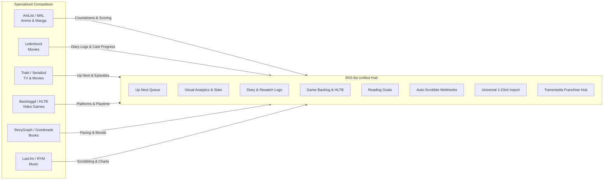

# IRIS-list Feature Research & Specification

## 1. Executive Summary

`IRIS-list` is the unified tracking and library management app in IRIS. Unlike single-domain trackers (Letterboxd for movies, AniList/MAL for anime, Backloggd for games, StoryGraph for books, Last.fm for music), **`IRIS-list` tracks 7 distinct media categories in one platform**:
1. **Anime**
2. **Manga & Light Novels**
3. **Movies**
4. **TV Shows**
5. **Video Games**
6. **Books**
7. **Music (Albums & Tracks)**

This document analyzes best-in-class features from specialized tracking services, evaluates their technical fit for IRIS, and outlines an implementation roadmap.

---

## 2. Competitive Feature Matrix



| Domain | Leading Sites | Key Features to Implement in IRIS | Impact | Effort |
| :--- | :--- | :--- | :---: | :---: |
| **Anime & Manga** | AniList, MyAnimeList, Kitsu | Airing countdowns, volume vs chapter tracking, seasonal charts (AniChart), multi-scale scoring | High | Medium |
| **Movies** | Letterboxd, IMDb | Chronological diary logs, rewatch counters with dates, cast & crew completion %, streaming availability | High | Medium |
| **TV Shows** | Trakt.tv, Serializd, TV Time | "Up Next" next-episode queue, season-by-season ratings, batch progress updates, personalized schedule | Very High | Medium |
| **Video Games** | Backloggd, HowLongToBeat, GG App | Platform tags (PC, PS5, Switch, Steam Deck), HLTB completion times, 100% mastery badge, backlog calculator | High | Low |
| **Books** | The StoryGraph, Goodreads, Hardcover | Annual reading goals & pace, progress by page & %, mood tags, format/edition (Audiobook, eBook, Physical) | Medium | Medium |
| **Music** | Last.fm, RateYourMusic, Stats.fm | Passive scrobbling via Spotify/Deezer, top tracks/artists leaderboards, key track highlights on albums | High | High |
| **Cross-Media** | SIMKL, Playnite | Unified "Tonight's Queue", lifetime media clock, transmedia franchise timeline, taste compatibility | Very High | High |

---

## 3. High-Priority Features for IRIS-list

### 1. Trakt-Style "Up Next" / "Next to Watch" Queue
- **Problem**: Current home dashboard displays poster cards with a generic `+1` increment button. Users cannot see what episode is next, what it is titled, or when it airs.
- **Solution**:
  - For TV & Anime: Cards show the exact next unwatched episode (e.g., *S1E12 "A Real Hero"*), thumbnail, air date, and a 1-click **"Mark Ep 12 Watched"** button.
  - For Manga & Books: Progress bar with page/chapter counter and percentage.
  - Sort options: *Recently Watched*, *Airing Soon*, *Highest Priority*.

### 2. Comprehensive Visual Analytics Suite (Filling the `stats` Tab)
- **Problem**: The `stats` tab in `user-list-view.tsx` currently displays placeholder text (*"Statistics will appear here"*), despite the `UserStats` model already being defined in Prisma.
- **Solution**:
  - **Score Distribution Curve**: Bar chart showing score breakdown, mean score, and standard deviation.
  - **Genre Radar Chart**: Interactive radar visualization of genre preferences across media types.
  - **Lifetime Media Clock**: Calculated time spent: days of anime/TV, hours of gaming, pages of books, track scrobbles.
  - **Top Creators & Studios**: Leaderboards for top anime studios, movie directors, game studios, and authors.
  - **Release Era Heatmap**: Media consumption across release decades (80s, 90s, 2000s, 2010s, 2020s).

### 3. Chronological Diary & Multi-Rewatch Logging
- **Problem**: Entries only record a single `startedAt` and `completedAt`. Rewatching a film or re-reading a book overwrites or hides previous logs.
- **Solution**:
  - Dedicated `/IRIS-list/lists/[username]/diary` view.
  - Multiple log entries per title with: exact watch date, rewatch boolean, rating given at that viewing, mini-review, and venue/platform tags (`#cinema`, `#imax`, `#plane`, `#steam-deck`).

### 4. Game Backlog Engine (HowLongToBeat + Platforms)
- **Problem**: Game list lacks platform context and playtime estimations.
- **Solution**:
  - **Platform Badges**: Tag entries with platform played on (PC, PS5, Switch, Xbox, Steam Deck, Retro).
  - **Mastery / 100% Status**: Dedicated badge for platinum/completionist status beyond main story completion.
  - **HLTB Times**: Show crowd-sourced averages (*Main Story*, *Main + Extras*, *Completionist*) directly on cards.
  - **Backlog Estimator**: Total estimated hours needed to clear active backlog.

### 5. Annual Media Challenges & Reading Goals
- **Problem**: No motivational goal tracking exists.
- **Solution**:
  - User-configurable goals (e.g., *"Read 25 Books in 2026"*, *"Watch 50 Movies in 2026"*).
  - Real-time pace tracker (*"2 titles ahead of schedule"*).
  - Annual "IRIS Rewind / Wrapped" infographic card at year-end.

### 6. Seasonal Anime & TV Browser with Rankings
- **Problem**: `/IRIS-list/rankings` and `/IRIS-list/discover` are currently empty stubs (`<>page</>`).
- **Solution**:
  - **Seasonal Chart View**: AniChart-style grid grouped by season (Winter/Spring/Summer/Fall) and release day.
  - **Airing Countdowns**: Real-time ticker (*"Ep 6 airs in 1d 14h"*).
  - **Rankings**: Top Rated All-Time, Most Popular, Trending This Week, Top Hidden Gems.
  - **Tier List Maker**: Drag-and-drop tool to arrange list entries into S/A/B/C/D tiers and export as an image.

### 7. Universal 1-Click Data Importer
- **Problem**: Manually recreating lists is the primary blocker for users switching from existing trackers.
- **Solution**:
  - 1-click import from:
    - **MyAnimeList** (XML export)
    - **AniList** (Username / GraphQL fetch)
    - **Letterboxd** (CSV export)
    - **Goodreads** (CSV export)
    - **Trakt.tv** (JSON export)
    - **Steam** (SteamID public library sync)

### 8. Automated Scrobbler & Webhook Bridge
- **Problem**: Media played on home servers or streaming apps requires manual tracking.
- **Solution**:
  - Leverage `@IRIS/connections` to receive webhooks from:
    - **Plex & Jellyfin**: Automatically increment TV/Movie/Anime progress when media reaches 90% watched.
    - **Steam**: Background sync of playtime hours and achievements.
    - **Spotify / Deezer**: Scrobble tracks directly into `MusicList`.

### 9. Social Taste Compatibility & Collaborative Lists
- **Problem**: User interaction is limited to static list comments and activity logs.
- **Solution**:
  - **Affinity Score**: Pearson correlation score between two users based on shared scored titles (*"88% Taste Match"*).
  - **List Compare View**: Side-by-side view showing score differences and titles one user loved that the other hasn't seen.
  - **Collaborative Lists**: Shared watchlists editable by multiple users (couples, watch clubs).

### 10. Transmedia Franchise Universe Hubs (IRIS Superpower)
- **Problem**: Intellectual properties spanning multiple mediums (*The Witcher*, *Cyberpunk*, *Dune*, *NieR*) are fragmented across single-medium trackers.
- **Solution**:
  - Unified franchise pages linking Novels, Manga, Games, Anime, Movies, TV, and Soundtracks.
  - **Franchise Completion Progress**: *"65% Franchise Complete (Played Game, Watched Anime, Read Novel 1 & 2)"*.

---

## 4. Phased Implementation Roadmap

```
Phase 1: High-Impact Core UX (Weeks 1-3)
├── [1] Up Next / Next-to-Watch Episodic Cards on WatchingDashboard
├── [2] Visual Statistics Suite in UserListView stats tab
└── [3] 1-Click Data Importer (MAL, AniList, Letterboxd)

Phase 2: Discovery & Domain Expansion (Weeks 4-6)
├── [4] Seasonal Chart Browser & Rankings (/rankings, /discover)
├── [5] Game Backlog Engine (Platforms + HLTB Integration)
└── [6] Reading Goals & Annual Media Challenges

Phase 3: Deep Integrations & Transmedia (Weeks 7-9)
├── [7] Chronological Diary & Multi-Rewatch Logging
├── [8] Automated Scrobbler Webhooks (Plex, Jellyfin, Steam)
├── [9] Social Taste Compatibility & List Compare
└── [10] Transmedia Franchise Hubs & Completionist Progress
```

---

## 5. Technical Alignment with IRIS Standards

- **Web Frontend**: Built in `apps/web` with Next.js App Router, Eden Treaty (`@/lib/elysia`), and `@workspace/ui` (shadcn/ui aria-rhea style, Mauve/Rose palette, Tabler icons, logical CSS properties).
- **Elysia Backend**: Modular endpoints in `apps/elysia/src/modules/IRIS-list/` with RFC 9457 error handling and cache integration via `@IRIS/cache`.
- **Database**: Extends existing Prisma schemas (`lists.prisma`, `stats.prisma`, `connection.prisma`, `activity.prisma`).
