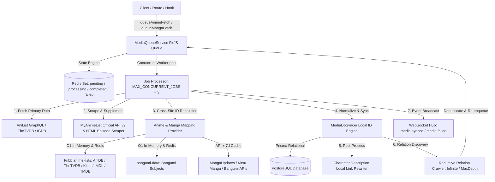

# IRIS Media Ingestion & Queue Specification (`@IRIS/media-queue`)

## 1. Executive Summary

`@IRIS/media-queue` is the distributed, high-throughput media ingestion and synchronization engine for IRIS. It ingests, unifies, normalizes, and recursively cross-links metadata across global entertainment databases (AniList, MyAnimeList, TheTVDB, MangaUpdates, Kitsu, Bangumi, IGDB, Google Books, MusicBrainz, and LRCLIB) into a unified PostgreSQL relational schema managed by Prisma.

---

## 2. Architecture & Queue Flow



### Core Design Principles:
1. **Local ID Supremacy**: The system never relies on external IDs as primary foreign keys. Every entity (`Anime`, `Manga`, `Character`, `Person`, `Studio`, `AnimeEpisode`) is mapped to an auto-incrementing local PostgreSQL integer `id`.
2. **Deterministic Source Partitioning**: Raw external links and provider snapshots are stored in typed `sources` and `images` JSONB structures, preserving timestamps and original URLs.
3. **Smart Rate-Limit Backoff**: Automatic proactive sleeping on rate-limit threshold exhaustion and dynamic retry on HTTP 429 (`x-ratelimit-remaining`, `x-ratelimit-reset`).
4. **Deep Parallel Batch Pagination**: 5 concurrent pages per batch (up to 25 pages / 1,250 items) for exhaustive Character and Staff extraction without queue thread blocking.
5. **Zero-API-Leak Link Rewriting**: Description markdown URLs (`anilist.co/character/:id`) are converted to `${NEXT_PUBLIC_URL}/IRIS-list/characters/:localId` purely via internal database lookups to prevent rate limit consumption.

---

## 3. External Providers, APIs & Exact Payload Keys

### A. AniList GraphQL (`https://graphql.anilist.co`)
- **Query Type**: POST JSON GraphQL.
- **Rate Limit**: 90 requests/minute. Proactive threshold sleep when remaining $\le 1$.

#### Key Payload Fields:
```typescript
interface AniListPayload {
  id: number;                          // AniList ID
  idMal?: number;                      // MyAnimeList cross-reference ID
  updatedAt?: number;                  // Epoch seconds
  title: {
    userPreferred: string;
    romaji?: string;
    english?: string;
    native?: string;
  };
  coverImage?: {
    extraLarge?: string;
    large?: string;
    medium?: string;
    color?: string;
  };
  bannerImage?: string;
  description?: string;                // HTML/Markdown description
  season?: "WINTER" | "SPRING" | "SUMMER" | "FALL";
  seasonYear?: number;
  episodes?: number;
  duration?: number;                   // In minutes (typically default estimate)
  chapters?: number;
  volumes?: number;
  genres?: string[];
  source?: AnimeSource;                // LIGHT_NOVEL, MANGA, ORIGINAL, VISUAL_NOVEL, etc.
  format?: AnimeFormat | MangaFormat;  // TV, TV_SHORT, MOVIE, OVA, MANGA, NOVEL, etc.
  status?: MediaStatus;                // FINISHED, RELEASING, NOT_YET_RELEASED, CANCELLED
  averageScore?: number;               // 0-100 scale (stored locally as 0.0-10.0 scale)
  popularity?: number;
  favourites?: number;
  airingSchedule?: {
    nodes: Array<{ id: number; episode: number; airingAt: number }>;
  };
  studios?: {
    edges: Array<{
      isMain: boolean;
      node: { id: number; name: string; isAnimationStudio: boolean; siteUrl?: string };
    }>;
  };
  characters?: {
    edges: Array<{
      role: "MAIN" | "SUPPORTING" | "BACKGROUND";
      node: {
        id: number;
        name: {
          full: string;
          native?: string;
          alternative?: string[];
          alternativeSpoiler?: string[]; // Spoiler aliases
        };
        image?: { large?: string; medium?: string };
        description?: string;
        gender?: string;
        age?: string;
        bloodType?: string;
        dateOfBirth?: { year?: number; month?: number; day?: number };
      };
      voiceActors?: Array<{
        id: number;
        name: { full: string; native?: string; alternative?: string[] };
        image?: { large?: string; medium?: string };
        description?: string;
        languageV2?: string;           // Japanese, English, French, German, Spanish, etc.
      }>;
    }>;
  };
  staff?: {
    edges: Array<{
      role: string;                    // Director, Character Design, Sound Director, etc.
      node: {
        id: number;
        name: { full: string; native?: string; alternative?: string[] };
        image?: { large?: string; medium?: string };
        description?: string;
        primaryOccupations?: string[];
      };
    }>;
  };
  relations?: {
    edges: Array<{
      relationType: string;            // SEQUEL, PREQUEL, SIDE_STORY, PARENT, ADAPTATION
      node: {
        id: number;
        type: "ANIME" | "MANGA";
        title: { userPreferred: string; english?: string; romaji?: string };
        coverImage?: { large?: string };
      };
    }>;
  };
}
```

---

### B. MyAnimeList Official API v2 (`https://api.myanimelist.net/v2`)
- **Headers**: `X-MAL-CLIENT-ID: <clientId>`
- **Anime Endpoint**: `GET /anime/{id}?fields=...`
- **Manga Endpoint**: `GET /manga/{id}?fields=...`

#### Fields Retrieved:
`id, title, main_picture, alternative_titles, start_date, end_date, synopsis, mean, rank, popularity, num_list_users, num_scoring_users, status, genres, num_episodes, start_season, broadcast, source, average_episode_duration, rating, studios, pictures, background, related_anime, recommendations`

---

### C. MyAnimeList HTML Episode Scraper
- **Base URL**: `https://myanimelist.net/anime/{id}/_/episode`
- **Single Page URL**: `https://myanimelist.net/anime/{id}/_/episode/{epNum}`
- **Extraction Rules**:
  - **Single Episode Duration**: Extracted from detail page metadata (e.g. `00:47:40` $\rightarrow$ parsed into integer minutes `48`).
  - **Episode Synopsis**: Extracted from detail page `<div class="desc">`, HTML entities decoded.
  - **Episode Titles**: Primary Japanese/Romaji title and Secondary English title.
  - **Episode Flags**: `isFiller`, `isRecap`, `malEpisodeId`.

---

### D. Cross-Site Mapping Engine (`AnimeMappingProvider`)

| Destination Platform | Source Feed / API | Cache Strategy | Normalized Model Column | `sources` JSON Key |
| :--- | :--- | :--- | :--- | :--- |
| **AniDB** | `Fribb/anime-lists` | 3-Day Redis + Memory Map | `aniDBId` (`Int`) | `sources.anidb` |
| **TheTVDB** | `Fribb/anime-lists` | 3-Day Redis + Memory Map | `tvDBId` (`Int`) | `sources.thetvdb` |
| **Bangumi** | `bangumi-data` & `api.bgm.tv` | 3-Day Redis / 7-Day API Cache | `bangumiId` (`Int`) | `sources.bangumi` |
| **Kitsu (Anime/Manga)** | `Fribb/anime-lists` & Kitsu API | 3-Day Redis / 7-Day API Cache | `kitsuId` (`Int`) | `sources.kitsu` |
| **IMDb** | `Fribb/anime-lists` | 3-Day Redis + Memory Map | `imdbId` (`String`) | `sources.imdb` |
| **TMDB** | `Fribb/anime-lists` | 3-Day Redis + Memory Map | `tmdbId` (`Int`) | `sources.tmdb` |
| **MangaUpdates** | `api.mangaupdates.com/v1` | 7-Day Redis Cache | `mangaUpdatesId` (`String`) | `sources.mangaupdates` |

### E. Cross-Site Mapping APIs (Anime & Manga)
- **Anime**: Uses Fribb `anime-lists` and `bangumi-data` lookup by `anilistId` / `malId` with 24-hour Redis caching.
- **Manga**:
  - **MangaUpdates**: `POST https://api.mangaupdates.com/v1/series/search` (`{ search: title, stype: "title" }`)
  - **Kitsu**: `GET https://kitsu.app/api/edge/manga?filter[text]={title}`
  - **Bangumi (v0 API)**: `POST https://api.bgm.tv/v0/search/subjects` (`{ keyword: titleNative || title, filter: { type: [1] } }`) for 100% native title accuracy.
  - Cached for 7 days in Redis.

---

## 4. Database Persistence & Relational Schema

### 1. `Anime` & `Manga` Models
- **Scores**: Stored as normalized `averageScore` (`Float` 0.0–10.0), `alAverageScore` (`Int` 0–100), `malAverageScore` (`Int` 0–100).
- **Sources JSON (`sources`)**:
  ```json
  {
    "anilist": { "id": 180746, "url": "https://anilist.co/anime/180746", "updatedAt": 1788195681 },
    "mal": { "id": 59711, "url": "https://myanimelist.net/anime/59711", "updatedAt": 1788195681 },
    "anidb": { "id": 18880, "url": "https://anidb.net/anime/18880" },
    "thetvdb": { "id": 454316, "url": "https://thetvdb.com/dereferrer/series/454316" },
    "bangumi": { "id": 504018, "url": "https://bgm.tv/subject/504018" },
    "kitsu": { "id": 48937, "url": "https://kitsu.app/anime/48937" }
  }
  ```
- **Images JSON (`images`)**:
  ```json
  {
    "anilist": ["https://s4.anilist.co/file/anilistcdn/media/anime/cover/large/..."],
    "mal": ["https://cdn.myanimelist.net/images/anime/1000/145233l.jpg"],
    "thetvdb": [
      "https://artworks.thetvdb.com/banners/v4/series/454316/posters/...",
      "https://artworks.thetvdb.com/banners/v4/series/454316/backgrounds/..."
    ]
  }
  ```

- **Genres**: Linked through a dedicated `Genre` table (`genres Genre[]`) with normalized unique `name` and indexed `slug` (e.g. `Action` $\rightarrow$ `action`) for fast filtering and searching.

### 2. `MediaCharacter` & `Person` (Voice Actors)
- **Multi-Language Voice Actor Architecture**:
  - Each character can have multiple voice actors across different languages (Japanese, English, French, German, Spanish, etc.).
  - A distinct `MediaCharacter` record is created for each actor with `(mediaType, mediaId, characterId, actorId)`.
  - The voice actor's language is stored on `Person.language` (e.g. `"Japanese"`, `"English"`).
  - Characters without voice actors (or Manga characters) have `actorId: null`.

### 3. `AnimeEpisode`
- Stores individual episode records linking `animeId`.
- Scraped fields: `number`, `titlePrimary`, `titleSecondary`, `titleNative`, `description`, `duration` (in real minutes), `airDate`, `isFiller`, `isRecap`.
- **AniSkip Skip Markers**:
  - `opStart` & `opEnd`: Opening song interval start and end (in seconds).
  - `edStart` & `edEnd`: Ending song interval start and end (in seconds).
  - `recapStart` & `recapEnd`: Episode recap interval start and end (in seconds).
  - `skipTimestamps`: Raw JSON array of all skip intervals from AniSkip (`op`, `ed`, `recap`, `mixed-op`, `mixed-ed`).

### 4. `Movie` Model & Multi-Source Mapping
- **Primary Source**: TheTVDB v4 API (`tvDBId`) for extended details, cast/characters, companies, and all artworks (`images.thetvdb`).
- **Secondary Enrichment**: **Simkl API v2** (`simklId`) providing:
  - `imdbId` (e.g. `tt4154796`) & `tmdbId` (e.g. `299534`)
  - `imdbRating` (e.g. `8.4★`) & `imdbVotes` (e.g. `1,483,294`)
  - `ageRating` (`PG-13`, `R`, `G`) & `ageRatingGuide`
  - `countryOfOrigin` (`United States of America`, `Japan`, etc.)
  - `releaseDateYear`, `releaseDateMonth`, `releaseDateDay`
### 5. `Tv` Model & Multi-Source Mapping
- **Primary Source**: TheTVDB v4 API (`tvDBId`) for extended series details, cast/characters, companies, artworks (`images.thetvdb`), seasons, and episodes.
- **Season 0 Filtering**: Season 0 (Specials) is strictly excluded from seasons and episodes. Only non-special seasons (`seasonNumber > 0`) are ingested into `TvSeason` and `TvEpisode`.
- **Secondary Enrichment**: **Simkl API v2** (`simklId`) providing:
  - `imdbId` (e.g. `tt29311421`) & `tmdbId` (e.g. `227192`)
  - `imdbRating` (e.g. `7.4★`) & `imdbVotes` (e.g. `3,432`)
  - `ageRating` (`TV-MA`, `TV-14`, etc.) & `ageRatingGuide`
  - `countryOfOrigin` (`KR`, `US`, etc.)
  - `firstAiredYear`, `firstAiredMonth`, `firstAiredDay`
  - Secondary English title if primary is native
- **Sources JSON (`sources`)**:
  ```json
  {
    "thetvdb": { "id": 432761, "url": "https://thetvdb.com/series/432761-series" },
    "imdb": { "id": "tt29311421", "url": "https://www.imdb.com/title/tt29311421" },
    "tmdb": { "id": 227192, "url": "https://www.themoviedb.org/tv/227192" },
    "simkl": { "id": 2125431, "url": "https://simkl.com/tv/2125431/pyramid-game" }
  }
  ```

---

## 5. Character Description Link Resolution Engine

Character descriptions often reference other characters via external AniList links:
```markdown
__Height:__ 156 cm
A student who sits next to [Ayanokouji](https://anilist.co/character/123212/Ayanokouji-Kiyotaka).
```

### Resolution Rules:
1. **Regex Filter**: Extracts `https?://(www.)?anilist.co/character/(\d+)(/.*)?`.
2. **Local DB Verification**: Queries `prisma.character.findUnique({ where: { anilistId } })`.
3. **Link Rewriting**: If found locally in PostgreSQL, replaces with:
   ```
   ${NEXT_PUBLIC_URL}/IRIS-list/characters/${localId}
   ```
4. **Zero API Consumption**: If the target character is not found in the local database, the URL is skipped without querying external APIs, preserving rate limits.
5. **Multiple Link Support**: All links in the description are processed sequentially before persisting the updated string.

---

## 6. Critical Gotchas & What to Watch Out For

> [!WARNING]
> **1. AniList Rate-Limit Threshold (90 req/min)**
> Never run unbounded parallel requests against AniList. Parallel batch pagination is capped at 5 concurrent requests (`pageBatch = [page, page+1, page+2, page+3, page+4]`). When `x-ratelimit-remaining <= 1`, the queue must sleep for `x-ratelimit-reset` seconds before making the next call.

> [!IMPORTANT]
> **2. PostgreSQL Unique Index on Nullable `actorId`**
> In Prisma schema, `MediaCharacter` has `@@unique([mediaType, mediaId, characterId, actorId])`.
> In PostgreSQL, unique indexes treat `NULL` values as distinct. When creating non-voiced character links (`actorId: null`), use `prisma.mediaCharacter.findFirst()` + `update`/`create` instead of composite unique `upsert` to avoid constraint collisions.

> [!TIP]
> **3. Episode Duration Discrepancies**
> AniList metadata returns an estimated default duration for regular series (often `24` minutes). Always prioritize MAL single episode detail page scraping to capture special premiere or finale lengths (e.g. `48` minutes for double-length pilot episodes).

> [!CAUTION]
> **4. Manga Source Enum Mapping**
> Manga source defaults must not fall back to `UNKNOWN`. Always map `AniListMangaPayload.source` through `this.mapAnimeSource(al.source, undefined)` to populate `LIGHT_NOVEL`, `MANGA`, `ORIGINAL`, `VISUAL_NOVEL`, `WEB_NOVEL`, or `DOUJINSHI`.

> [!NOTE]
> **5. Recursive Crawling Cycles & Deduplication**
> Media relationships are bidirectional (e.g., Anime A is Sequel to Anime B; Anime B is Prequel to Anime A). Always track processed jobs in Redis Set `media-queue:processing` and check `isJobActive()` before enqueuing discovered relations to prevent infinite crawler loops.

> [!IMPORTANT]
> **6. TheTVDB Non-Unique ID Linking for Multi-Season Series**
> In AniList, anime seasons are structured as distinct entries with unique `anilistId` values (e.g. S1, S2, S3 each have their own `Anime` record). In contrast, TheTVDB bundles all seasons under a single overall series entry. Therefore, `tvDBId` on `Anime` is non-unique (`tvDBId Int?`), allowing multiple local `Anime` records across seasons to link to the same parent TheTVDB series ID while importing all associated artworks into `images.thetvdb`.

---

## 7. Configuration & Environment Variables

| Variable | Default / Example | Purpose |
| :--- | :--- | :--- |
| `NEXT_PUBLIC_URL` | `http://localhost:3000` | Base URL used for localized character links |
| `REDIS_URL` | `redis://127.0.0.1:6379` | Distributed queue state, cache, and ID mapping store |
| `MAL_CLIENT_ID` | `(Optional Client ID)` | Official MyAnimeList API v2 authentication |
| `TVDB_API_KEY` | `(Optional Key)` | TheTVDB v4 API authentication |
| `IGDB_CLIENT_ID` | `(Optional Key)` | Twitch/IGDB Games API authentication |
| `IGDB_CLIENT_SECRET` | `(Optional Secret)` | Twitch/IGDB Games API authentication |
